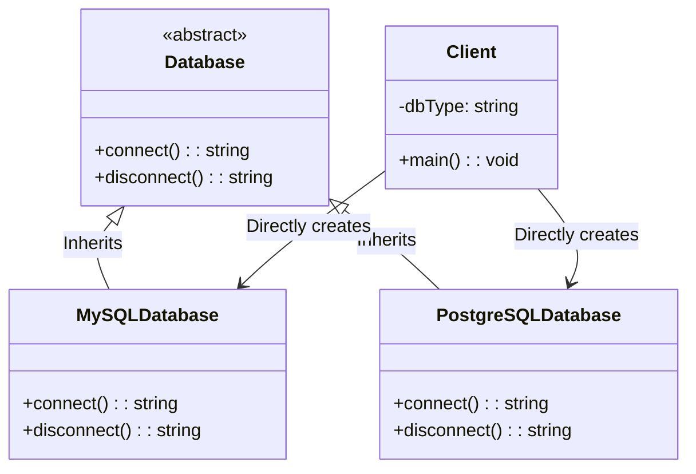
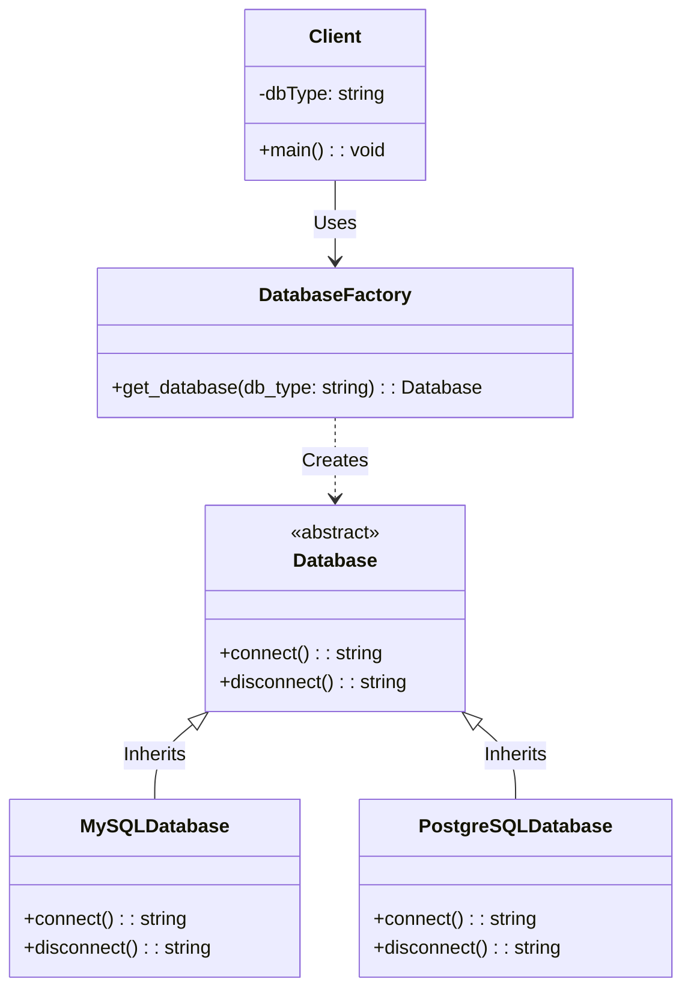

# Factory pattern

Factory pattern is example of a **creational pattern**. It aims to help in getting better software structure where object creation is isolated from client code (i.e. the code that need those objects).

# Example problem code

In the following code the user can select what type of database the system connects to. ´For the selected type of connection, we need to create on oject that encapsulates the details of connection:

```python
class Database:
    def connect(self):
        pass

    def disconnect(self):
        pass


class MySQLDatabase(Database):
    def connect(self):
        return "Connecting to MySQL Database"

    def disconnect(self):
        return "Disconnecting from MySQL Database"


class PostgreSQLDatabase(Database):
    def connect(self):
        return "Connecting to PostgreSQL Database"

    def disconnect(self):
        return "Disconnecting from PostgreSQL Database"


# Client code
if __name__ == "__main__":
    db_type = input("Enter the database type (mysql/postgresql): ").lower()
    
    if db_type == "mysql":
        db = MySQLDatabase()
    elif db_type == "postgresql":
        db = PostgreSQLDatabase()
    else:
        raise ValueError("Unsupported database type")
    
    print(db.connect())
    # Perform database operations
    print(db.disconnect())
```

The structural problem here is that the main function has way too many responsibilities: It handles user input, it needs to know the number of available database types, and it needs to know all the database classes by name (in general, having multiple responsibilies in example of **low cohesion** that is a thing to avoid, and having direct references to multiple other constructs is an example of **high coupling** which another thing to avoid). In the corresponding class diagram below, you see that numebr of direct links would increase when new database types are added, and every such change would result in changes in client code (and in this simple example we have only one client, so more complex setup would have exponential problems with changes)



## Factory pattern

So to fix this structure we create a factory class that takes care of creating the selected database connection class. In this specific solution the factory class has a dict of all available database connections, and it can the create an instance of any of those.  

```python
class Database:
    def connect(self):
        pass

    def disconnect(self):
        pass


class MySQLDatabase(Database):
    def connect(self):
        return "Connecting to MySQL Database"

    def disconnect(self):
        return "Disconnecting from MySQL Database"


class PostgreSQLDatabase(Database):
    def connect(self):
        return "Connecting to PostgreSQL Database"

    def disconnect(self):
        return "Disconnecting from PostgreSQL Database"


class DatabaseFactory:
    # Mapping of database types to their respective classes
    _databases = {
        "mysql": MySQLDatabase,
        "postgresql": PostgreSQLDatabase
    }

    @staticmethod
    def get_database(db_type):
        # Get the database class from the _databases dictionary
        db_class = DatabaseFactory._databases.get(db_type)
        if not db_class:
            raise ValueError("Unsupported database type")
        return db_class()


# Client code
if __name__ == "__main__":
    db_type = input("Enter the database type (mysql/postgresql): ").lower()
    try:
        db = DatabaseFactory.get_database(db_type)
        print(db.connect())
        # Perform database operations
        print(db.disconnect())
    except ValueError as e:
        print(e)
```

The factory solution can be shown as UML class diagram as below. You see that client has less coupling.



## Factory pattern benefits

The Factory Pattern offers several key benefits, especially in scenarios where direct instantiation of classes isn't ideal due to complexity, extensibility concerns, or when the instantiation logic might require more than just creating an object. Here are the primary advantages:

1. Decoupling: It decouples the creation of objects from their usage. This means the client code doesn't need to know about the concrete classes required to create these objects, only their interfaces. This leads to more robust and maintainable code since changes in the creation process or concrete classes don't affect the client code.
2. Single Responsibility Principle: The pattern helps to keep the system organized by ensuring that the creation logic is encapsulated in a single place. This adheres to the Single Responsibility Principle, one of the SOLID principles, which states that a class should have only one reason to change. The factory handles the creation of objects, while other classes focus on their core responsibilities.
3. Flexibility and Extensibility: The Factory Pattern provides a flexible and scalable structure for creating objects. If you need to add a new type of object to your application, you can simply extend the factory without modifying the existing client code. This is particularly beneficial in larger applications or libraries where you might need to add new features or support new types without disrupting existing functionality.
4. Complex Creation Logic: In some cases, the creation of an object might involve complex logic, such as configuration, initialization with specific data, or integration with other systems. Encapsulating this logic within a factory makes the client code simpler and cleaner, as it abstracts away the complexity of object creation.
5. Consistency: When creating multiple instances of an object throughout your application, using a factory ensures that all objects are created consistently. This is especially useful if the object creation process changes, as you only need to update the logic in one place rather than in every place where the object is instantiated.

## Related patterns

The Factory Pattern is part of the creational design patterns group, which focuses on object creation mechanisms. Several patterns are related to the Factory Pattern, each serving different scenarios but sometimes overlapping in their principles. Here are a few:

1. Abstract Factory Pattern:
- Like the Factory Method, the Abstract Factory Pattern is used to create families of related or dependent objects without specifying their concrete classes.
- The key difference is that the Abstract Factory uses multiple factory methods, one for each type of object to be created, encapsulated within an interface.
- It's useful when you have multiple products that belong to a product family and you want to ensure your system remains independent from how these products are created.
2. Builder Pattern:
- The Builder Pattern is used to construct a complex object step by step. Unlike factory patterns that construct objects in a single call, Builder provides a way to build an object through a series of steps, allowing for more control over the final object's configuration.
- It's particularly useful when an object needs to be initialized with a lot of parameters, some of which might be optional.
3. Prototype Pattern:
- This pattern is used to create objects by cloning an existing object. It allows for the addition of any subclass instance of a known super class at runtime.
- The Prototype Pattern can be seen as an alternative to the Factory Method Pattern, especially when creating an object is more efficient or complex than copying an existing instance.
4. Singleton Pattern:
- Although not directly related to object creation through factories, the Singleton Pattern ensures that a class has only one instance and provides a global point of access to it.
- In some implementations of the Factory Pattern, particularly with Abstract Factories or when configuring a factory with properties or settings, the Singleton Pattern may be used to ensure only one instance of a factory is created.

## More details

https://www.youtube.com/watch?v=s_4ZrtQs8Do


## To do

Apply factory pattern to the code in this folder (make a copy of python file to keep both versions).
1. Refactor the Code: Your task is to refactor the NotificationManager class to use the Factory Pattern for creating notification sender objects. This involves creating a separate factory class that encapsulates the logic of instantiating notification sender objects. 
2. Extend the Notification System: After refactoring, add a new notification type (e.g., SlackNotification) to demonstrate how the Factory Pattern makes it easier to extend the system with new types of notifications without modifying the existing factory logic.
3. Encapsulate Object Creation: Ensure that the client code (NotificationManager in this case) does not directly instantiate the notification sender objects. It should only interact with the factory class/interface to get these objects.

