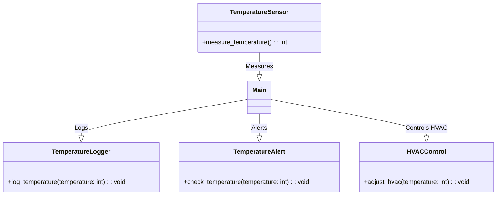
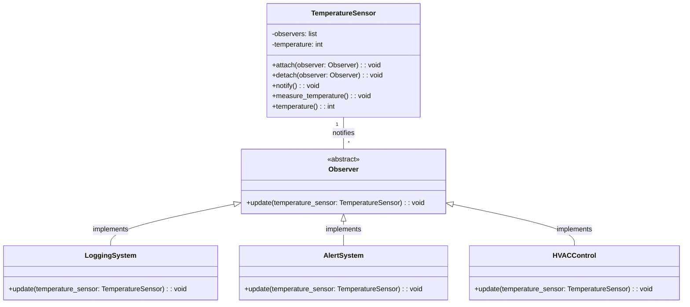

# Observer pattern

The Observer Pattern is a software design pattern in which an object, known as the subject, maintains a list of its dependents, called observers, and notifies them automatically of any state changes, usually by calling one of their methods. It's widely used in implementing distributed event handling systems, in model-view-controller (MVC) architectural patterns, and more.

# An example program before applying the pattern

This a rather classic controller code, where the main loop is responsible for getting new temperature readings and sending that data to all consumers. The main problem with this code is that the number and names of data consumers is fixed at design time, maybe it is necessary to add or remove some consumers depending on system setup. 

```python
class TemperatureSensor:
    def measure_temperature(self):
        # Simulate temperature measurement
        temperature = 22  # This would be replaced by actual sensor reading logic
        return temperature

class TemperatureLogger:
    def log_temperature(self, temperature):
        print(f"Logging new temperature: {temperature}°C")

class TemperatureAlert:
    def check_temperature(self, temperature):
        if temperature > 25:
            print(f"Alert: Temperature is too high! ({temperature}°C)")

class HVACControl:
    def adjust_hvac(self, temperature):
        if temperature < 20:
            print("HVAC Control: Activating heating.")
        elif temperature > 25:
            print("HVAC Control: Activating cooling.")
        else:
            print("HVAC Control: Temperature is optimal. No action needed.")

# Main program
def main():
    # Create objects
    temperature_sensor = TemperatureSensor()
    logger = TemperatureLogger()
    alert = TemperatureAlert()
    hvac_control = HVACControl()

    # Measure temperature
    new_temperature = temperature_sensor.measure_temperature()

    # Pass new temperature data to all consumers
    logger.log_temperature(new_temperature)
    alert.check_temperature(new_temperature)
    hvac_control.adjust_hvac(new_temperature)

if __name__ == "__main__":
    main()

```



# Refactored using observer pattern

Here's a basic example in Python that demonstrates the Observer Pattern. This example includes a TemperatureSensor class that maintains a list of observers that want to be notified of any changes in its state. There are also three observer classes, which react to updates from the TemperatureSensor.

```python
class TemperatureSensor:
    def __init__(self):
        self._observers = []
        self._temperature = 0

    def attach(self, observer):
        self._observers.append(observer)

    def detach(self, observer):
        self._observers.remove(observer)

    def notify(self):
        for observer in self._observers:
            observer.update(self)

    def measure_temperature(self):
        # Simulate temperature measurement
        self._temperature = 22  # This would be replaced by actual sensor reading logic
        self.notify()

    @property
    def temperature(self):
        return self._temperature

class Observer:
    def update(self, temperature_sensor):
        pass

class LoggingSystem(Observer):
    def update(self, temperature_sensor):
        print(f"Logging new temperature: {temperature_sensor.temperature}°C")

class AlertSystem(Observer):
    def update(self, temperature_sensor):
        if temperature_sensor.temperature > 25:
            print(f"Alert: Temperature is too high! ({temperature_sensor.temperature}°C)")

class HVACControl(Observer):
    def update(self, temperature_sensor):
        if temperature_sensor.temperature < 20:
            print("HVAC Control: Activating heating.")
        elif temperature_sensor.temperature > 25:
            print("HVAC Control: Activating cooling.")
        else:
            print("HVAC Control: Temperature is optimal. No action needed.")

# Example usage
temperature_sensor = TemperatureSensor()
logging_system = LoggingSystem()
alert_system = AlertSystem()
hvac_control = HVACControl()

temperature_sensor.attach(logging_system)
temperature_sensor.attach(alert_system)
temperature_sensor.attach(hvac_control)

# Simulate a temperature measurement
temperature_sensor.measure_temperature()
```




## Observer pattern benefits

1. Decoupling of Publisher and Subscriber: The Observer Pattern allows the subject (publisher) and its observers (subscribers) to operate independently. Observers can subscribe to or unsubscribe from the subject without requiring changes to the subject and vice versa. This loose coupling facilitates easier maintenance and extension of the system.
2. Dynamic Subscription: Objects can decide at runtime whether to observe another object, providing flexibility in managing subscriptions. This allows for adding or removing observers on the fly without impacting the subject or other observers.
3. Broadcast Communication: The Observer Pattern enables broadcast communication from the subject to all interested observers. When a state change occurs, the subject simply notifies its list of observers, without needing to know their specific details or functionalities. This is particularly useful in event-driven systems.
4. Support for Complex Event Processing: It facilitates complex event processing by allowing objects to react to a wide range of events without requiring tight integration. Different observers can respond to the same event in different ways, enabling a modular approach to handling events.
5. Ease of Application Evolution: The pattern supports the principle of open/closed design by making it easy to introduce new observers for new functionalities without modifying the subject or existing observers. This aids in extending the application's capabilities with minimal changes.
6. Promotes Reusability: The Observer Pattern promotes reusability through the separation of concerns. The same observer can be used across different subjects, or the same subject can notify different types of observers, making components more reusable.
7. Scalability in the Event Handling System: It's easier to scale the event handling system as new types of events or observers are introduced. The pattern can accommodate growth in complexity without significant increases in system coupling or the need for extensive rewrites.

## Another example

https://www.youtube.com/watch?v=oNalXg67XEE

## To Do 

Apply observer pattern to the code in this folder (create a copy of the file before editing so that you have both versions). The code has Subject class with an internal state, and if the state changes the consumers need to be notifies. In current version the state is nicely encapsulated, but it contains a static list of local consumers. Apply observer pattern, and move the local consumer functions into a separate class each. 
