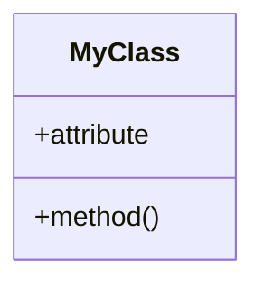
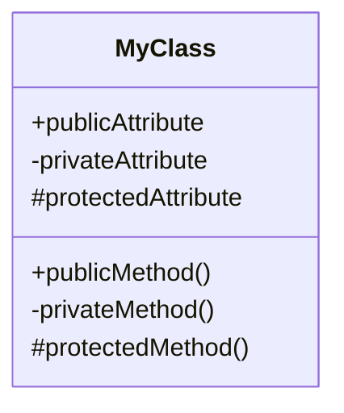
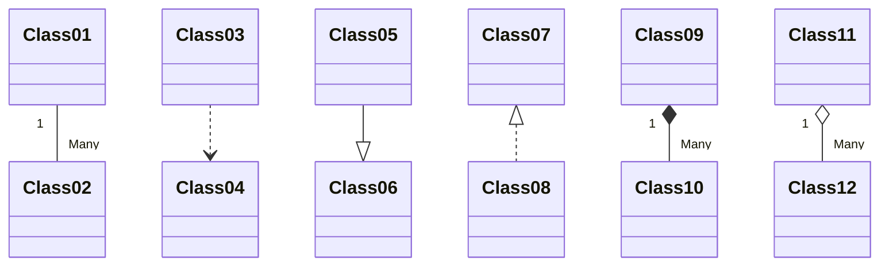
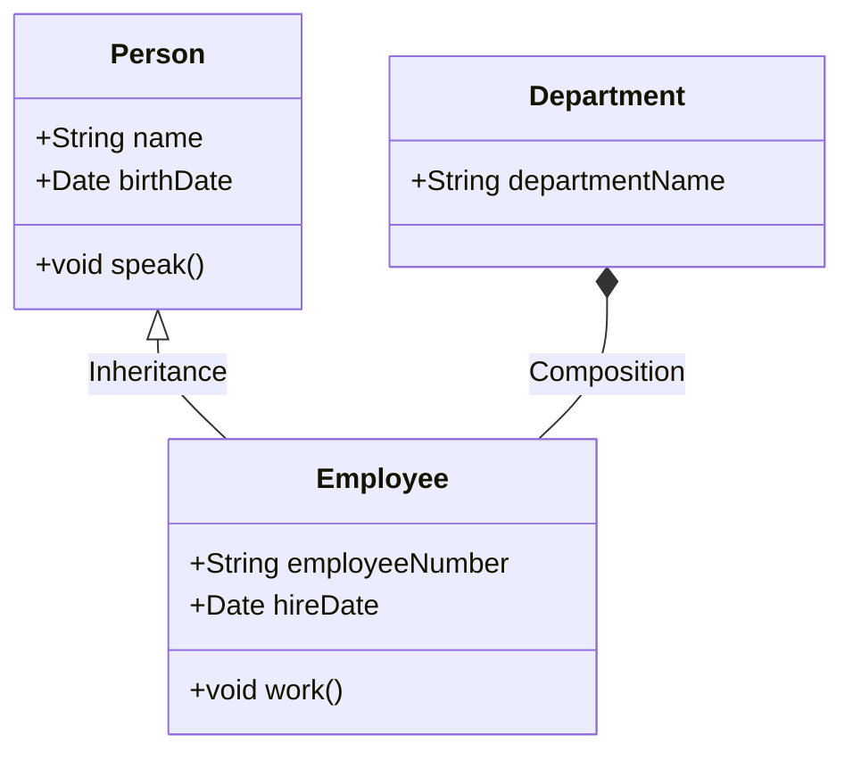

# UML 

Unified Modeling Language (UML) is a standardized modeling language that provides a way to visualize a system's architectural blueprints, including its elements, relationships, and dynamics. It encompasses a set of graphical notation techniques to create abstract models of software-intensive systems. UML is versatile, supporting various types of diagrams to cover conceptual, structural, and behavioral aspects, such as class diagrams for structure, sequence diagrams for behavior, and use case diagrams for interactions. It facilitates communication among stakeholders (developers, analysts, architects, and clients) by providing a common language that aids in the design and understanding of software projects. UML is widely used in software engineering for planning, analyzing, and documenting software systems, making it an essential tool for both large-scale and small-scale software development.

# UML and mermaid

Mermaid is textual description of diagrams that can be rendered by gitlab natively. In your markdown documentation you can add mermaid diagrams in the middle of text within mermaid blocks (see source of this document!)

```code
classDiagram
    class MyClass {
        +attribute
        +method()
    }
```




# UML Class Diagrams



The diagram above defines a class MyClass with:

Public attributes and methods (+), indicating they are accessible from any part of the code.
Private attributes and methods (-), indicating they are accessible only within the class itself.
Protected attributes and methods (#), indicating they are accessible within the class and by derived classes.



in the diagrams above 

-- denotes an association, indicating a link between two classes (e.g., Class01 contains many instances of Class02).
..> represents a dependency, where one class uses or depends upon another (e.g., Class03 depends on Class04).
--|> signifies inheritance, showing that one class is a subclass of another (e.g., Class05 inherits from Class06).
<|.. indicates realization, typically used when a class implements an interface or abstract class (e.g., Class08 realizes Class07).
*-- represents composition, a strong form of association with a strong lifecycle dependency (e.g., Class09 is composed of many instances of Class10).
o-- denotes aggregation, a form of association that represents a "has-a" relationship with a weaker lifecycle dependency (e.g., Class11 is aggregated with many instances of Class12).


## Example 


