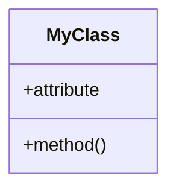
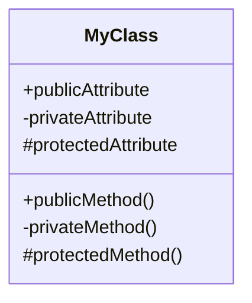
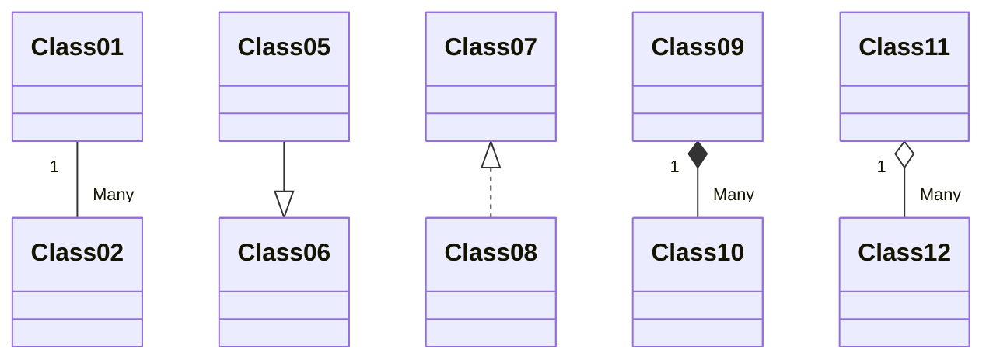
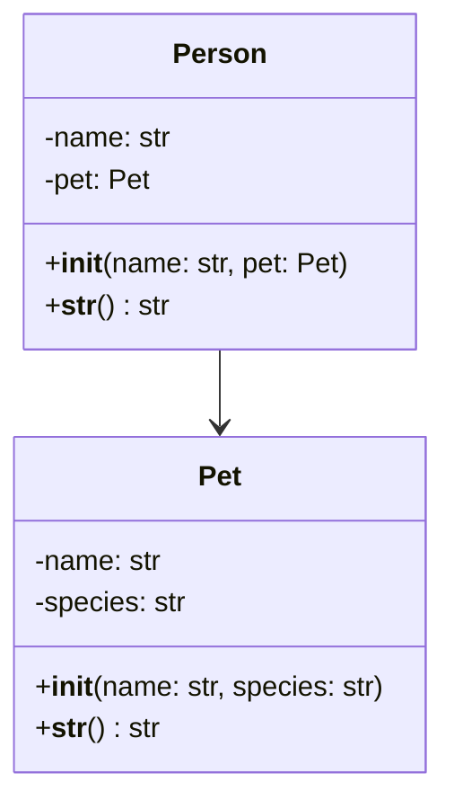
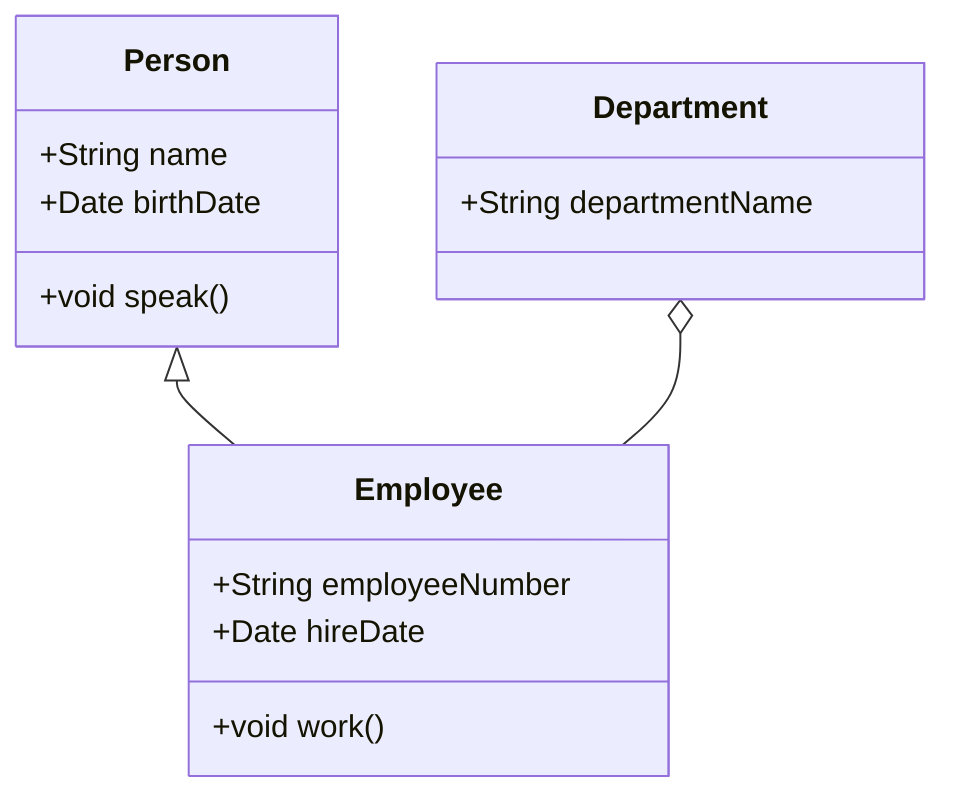

# UML 

Unified Modeling Language (UML) is a standardized modeling language that provides a way to visualize a system's architectural blueprints, including its elements, relationships, and dynamics. It encompasses a set of graphical notation techniques to create abstract models of software-intensive systems. UML is versatile, supporting various types of diagrams to cover conceptual, structural, and behavioral aspects, such as class diagrams for structure, sequence diagrams for behavior, and use case diagrams for interactions. It facilitates communication among stakeholders (developers, analysts, architects, and clients) by providing a common language that aids in the design and understanding of software projects. UML is widely used in software engineering for planning, analyzing, and documenting software systems, making it an essential tool for both large-scale and small-scale software development.

UML has multiple diagram types. Maybe the most common diagram type is **class diagram** that models class properties and relations to other classes. **Sequence diagram** models the interaction sequences between multiple objects. 

# UML and mermaid

Mermaid is textual description of diagrams that can be rendered by gitlab natively. In your markdown documentation you can add mermaid diagrams in the middle of text within mermaid blocks (see source of this document!)

```code
classDiagram
    class MyClass {
        +attribute
        +method()
    }
```




## UML Class Diagrams: Classes

More on class diagrams in https://www.visual-paradigm.com/guide/uml-unified-modeling-language/uml-class-diagram-tutorial/ for example



The diagram above defines a class MyClass with:

**Public** attributes and methods (+), indicating they are accessible from any part of the code.  
**Private** attributes and methods (-), indicating they are accessible only within the class itself.  
**Protected** attributes and methods (#), indicating they are accessible within the class and by derived classes.  

There are two common syntaxes for showing the types of attributes, both are acceptable (use only one syntax, don't mix):  
```
+int age
+age : int
```

Note that in practise, a diagram does not always show all possible attributes or methods. it is possible to show only those relevant to current diagram purposes. 

## UML Class Diagrams: Common class relationships

```
classDiagram
    Class01 "1" -- "Many" Class02
    Class05 --|> Class06
    Class07 <|.. Class08
    Class09 "1" *-- "Many" Class10
    Class11 "1" o-- "Many" Class12
```



in the diagrams above 

-- **Line** denotes an **association**, indicating a link between two classes (e.g., Class01 contains a reference to Class02 or vice versa, or both). This basic association is the most common link between classes. Association can have direction using basic arrowhead (--> or both directions  <-->) to indicate which class has the link to other class. Example from exercise 9.2.1 Pets **note** that although this example shows methods `__init__` and `__str__` it not common to show all existing methods; usually you show only the methods that are relevant for the diagram purposes. See part "Perspectives of class diagram" in tutorial linked above!



--|> **Open ended arrow** signifies **inheritance**, showing that one class is a subclass of another (e.g., Class05 inherits from Class06). NOTE that the arrow direction is towards generalization i.e. to parent class.    

<|.. **Open ended dotted line arrow** indicates **realization**, typically used when a class implements an interface or abstract class (e.g., Class08 realizes Class07).  

*-- **Filled rectangle** ended line represents **composition**, a strong form of association with a strong lifecycle dependency (e.g., Class09 creates a list (or any collection) of many instances of Class10, and all instances are deleted when container class09 is deleted).  

o-- **Open rectangle** ended line denotes **aggregation**, a form of association that represents a "has-a" relationship with a weaker lifecycle dependency (e.g., Class11 has a collection of many instances of Class12, and those instances continue to exist even after container class11 is deleted).  


## Example 

Employee class is inherited from Person class (inherited attributes and methods are never shown). A Department can contain multiple Employees. Aggregate association between Employees and Department indicates that employment does not necessarily end in case the department is closed.




## To do

Create "diagram.md" documents for all exercises in part 10 (one file in each exercise folder). For each exercise, design class diagram showing the class, their key properties and relatioships.
